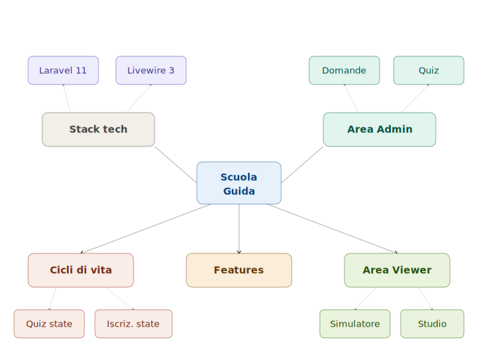
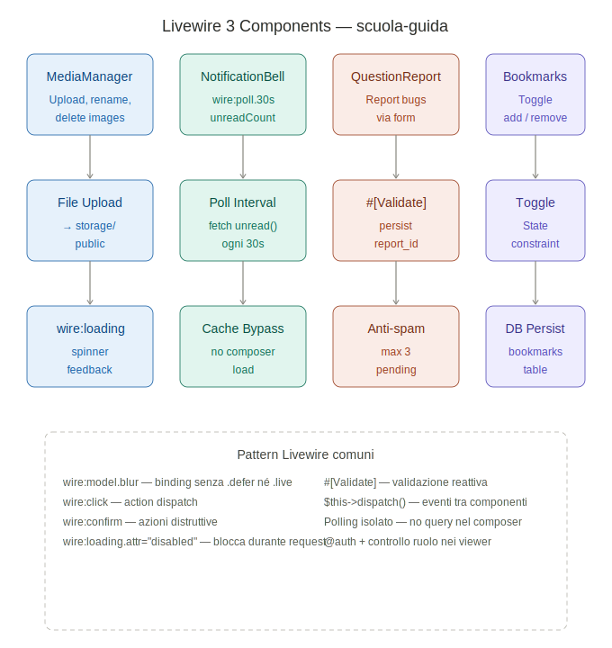
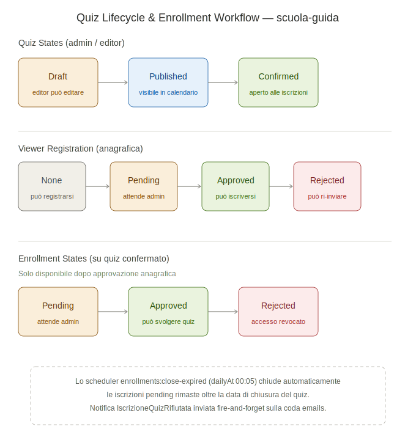
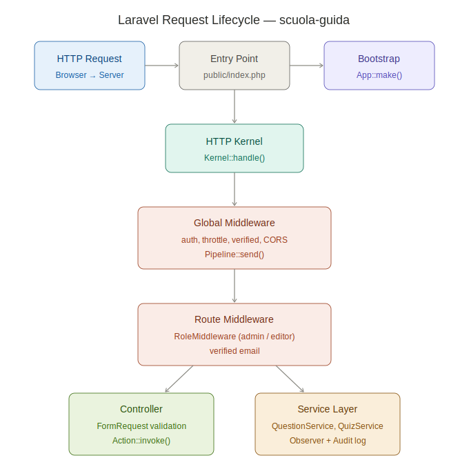
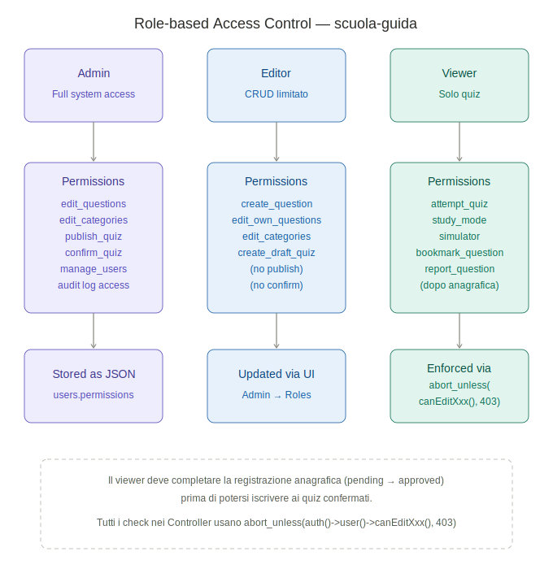

# ScuolaGUIDA — Quiz App

Applicazione web per la gestione di quiz della patente di guida. Gli amministratori creano domande, le raggruppano in quiz e gestiscono l'intero ciclo di vita (bozza → pubblicato → confermato); gli utenti si registrano con email/password, completano la propria scheda anagrafica e — una volta approvati dall'amministratore — richiedono l'iscrizione ai quiz ufficiali, li svolgono e consultano le proprie statistiche. È disponibile anche una **Modalità Studio** per esercitarsi liberamente senza timer né punteggio (con **materiale didattico** per categoria: PDF, video YouTube e note), un **Simulatore Esame** che riproduce il formato ufficiale ministeriale (30 domande, 20 minuti, max 3 errori), la possibilità di **salvare le domande** in modo persistente con nota personale opzionale, un sistema di **segnalazione errori** che permette al viewer di comunicare problemi sulle domande, una pagina di **revisione errori** aggregata che mostra le domande sbagliate nei tentativi recenti con conteggio e toggle "imparata", un **Piano di studio personalizzato** generato a partire da un breve **Test diagnostico** (una domanda per categoria) che ordina le categorie per debolezza e suggerisce le azioni di studio prioritarie, e un sistema di **Ripasso intelligente** (algoritmo SM-2) che traccia automaticamente ogni risposta e propone sessioni di ripasso ordinate per urgenza con intervalli crescenti. I ruoli `admin` ed `editor` accedono all'area di gestione tramite **autenticazione a due fattori (TOTP)** obbligatoria, con codici di emergenza one-time e reset via comando Artisan.

**Stack:** Laravel 11 · Blade · AdminLTE 3 · Bootstrap 5 · Livewire 3 · Alpine.js · MySQL

## Panoramica Architettura



---

## Installazione

### Prerequisiti

| Tool | Versione minima |
|---|---|
| PHP | 8.3 |
| Composer | 2.x |
| Node.js | 18.x |
| MySQL | 8.x (o MariaDB 10.6+) |

> Con [Laragon](https://laragon.org/) su Windows tutti i prerequisiti sono già inclusi.

### 1. Clona il repository

```bash
git clone <url-repo> scuola-guida
cd scuola-guida
```

### 2. Dipendenze PHP e Node

```bash
composer install
npm install
```

### 3. Configurazione ambiente

```bash
cp .env.example .env
php artisan key:generate
```

Imposta le credenziali del database in `.env`:

```env
DB_CONNECTION=mysql
DB_HOST=127.0.0.1
DB_PORT=3306
DB_DATABASE=scuola_guida
DB_USERNAME=root
DB_PASSWORD=
```

### 4. Database e dati iniziali

```bash
# Reset completo con dati fittizi (sviluppo locale)
php artisan migrate:fresh --seed

# Solo struttura + dati reali di produzione (admin, ruoli, categorie, domande reali)
php artisan migrate:fresh
php artisan db:seed --class=Database\\Seeders\\ProductionSeeder
```

Il seeder di default crea:
- Utente **admin** — `admin@test.com` / `password`
- Categorie, domande campione, quiz di esempio con tentativi fittizi

> **Prerequisito per il seeding di categorie e domande reali**
>
> `CategorySeeder` e `QuestionSeeder` (usati da entrambi `DatabaseSeeder` e `ProductionSeeder`) leggono i dati da un file Excel che **non è incluso nel repository** e deve essere posizionato manualmente prima di eseguire qualsiasi seed:
>
> ```
> storage/app/imports/file_con_category_id.xlsx
> ```
>
> Il file deve contenere due fogli:
>
> | Foglio | Colonne | Contenuto |
> |---|---|---|
> | `Categorie` | `category_name`, `category_id` | Le 18 categorie della scuola guida con il loro ID |
> | `Domande` | `question`, `is_true`, `image`, `category_id`, `category_name` | Le domande del listato (7143 righe) |
>
> Se il file è assente, i seeder stampano un errore e terminano senza modificare il database.

### 5. Storage pubblico

```bash
php artisan storage:link
```

Crea il symlink `public/storage → storage/app/public` richiesto per le immagini delle domande.

### 6. Email di notifica (Mailtrap)

Il flusso iscrizioni invia email di cortesia (approvazione/rifiuto anagrafica e quiz, nuove richieste agli admin). In sviluppo conviene usare [Mailtrap](https://mailtrap.io) per intercettarle senza spedirle a indirizzi reali.

1. Crea un inbox gratuito su Mailtrap e copia le credenziali SMTP.
2. In `.env` valorizza la sezione `MAIL_*` (vedi `.env.example`):

```env
MAIL_MAILER=smtp
MAIL_HOST=sandbox.smtp.mailtrap.io
MAIL_PORT=2525
MAIL_USERNAME=<utente Mailtrap>
MAIL_PASSWORD=<password Mailtrap>
MAIL_ENCRYPTION=tls
MAIL_FROM_ADDRESS="noreply@scuolaguida.local"
MAIL_FROM_NAME="${APP_NAME}"
```

In alternativa, per non spedire nulla, usa `MAIL_MAILER=log` (le email finiscono in `storage/logs/laravel.log`).

### 7. Worker della coda email

Le notifiche vengono accodate sulla coda `emails` (driver `database`, già impostato in `.env.example`). In sviluppo lancia il worker in un terminale dedicato:

```bash
php artisan queue:work --queue=emails
```

Il workflow utente non si blocca mai se il worker è spento o se l'SMTP è down: le email sono "fire-and-forget" e verranno processate quando il worker tornerà attivo.

### 8. Scheduler (chiusura automatica iscrizioni scadute)

Il comando `enrollments:close-expired` chiude ogni giorno le iscrizioni `pending` rimaste oltre la data di chiusura impostata sui quiz confermati (vedi *Schedulazione iscrizioni* nell'area admin). È registrato in `routes/console.php` con frequenza `dailyAt('00:05')`.

**In produzione** basta una singola voce di crontab che esegue lo scheduler di Laravel ogni minuto:

```cron
* * * * * cd /percorso/del/progetto && php artisan schedule:run >> /dev/null 2>&1
```

**In sviluppo**, per verificare il comportamento subito:

```bash
# Esecuzione manuale del singolo comando
php artisan enrollments:close-expired

# Oppure lo scheduler in foreground (esegue i comandi schedulati al momento giusto)
php artisan schedule:work
```

Ogni esecuzione registra in `storage/logs/laravel.log` (`Log::info`) il quiz toccato, il numero di iscrizioni chiuse e la `enrollments_close_at` di riferimento. A ogni iscrizione chiusa viene inviata la notifica `IscrizioneQuizRifiutata` all'utente (fire-and-forget sulla coda `emails`).

### 9. Avvia il server di sviluppo

```bash
# Terminale 1 — asset Vite (hot reload)
npm run dev

# Terminale 2 — server PHP
php artisan serve

# Terminale 3 — worker email (opzionale, vedi sopra)
php artisan queue:work --queue=emails
```

Apri [http://127.0.0.1:8000](http://127.0.0.1:8000), accedi con `admin@test.com` / `password` e vai su `/admin/quizzes`.

### Comandi utili

```bash
php artisan test                                    # esegui la test suite
php artisan migrate:fresh --seed                    # reset completo del DB
php artisan route:list                              # elenco di tutte le route
php artisan questions:import-mit /path/file.xlsx   # import listato MIT (vedi config/mit_import.php)
php artisan questions:import-mit /path/file.xlsx --dry-run        # anteprima senza scrivere
php artisan questions:import-mit /path/file.xlsx --topic=2        # solo argomento 2
php artisan questions:import-mit /path/file.xlsx --update-existing # aggiorna i duplicati
php artisan 2fa:reset {user_id}                    # azzera il 2FA di un admin/editor (recovery)
```

---

## Funzionalità

### Area Admin / Editor

- **Domande** — CRUD, upload immagine, import/export Excel, import listato MIT, bulk delete, filtro DataTable
- **Categorie** — CRUD con slug auto-generato; gestione **materiale didattico** per categoria (PDF, link/YouTube, note testuali) con drag-and-drop per il riordinamento (`admin/categories/{id}/materials`)
- **Quiz** — creazione manuale o casuale, gestione domande con drag-and-drop reorder, parametri (numero massimo domande, tempo limite, errori massimi tollerati)
- **Ciclo di vita quiz** — `draft → published → confirmed` (vedi sotto)
- **Iscrizioni anagrafiche** — visualizza i dati anagrafici inviati dai viewer (nome, cognome, indirizzo, data e luogo di nascita, codice fiscale, documento di identità), approva o rifiuta la richiesta di iscrizione definitiva con motivazione opzionale
- **Iscrizioni quiz** — approva o rifiuta le richieste degli utenti già abilitati; può riaprire un'iscrizione già completata
- **Catalogo "Quiz disponibili" in sola lettura** — admin ed editor non partecipano agli esami ufficiali, ma possono comunque consultare il catalogo (`quiz/confirmed`) per verificare la lista dei quiz confermati. Le voci di menu "Le mie iscrizioni" e "I miei tentativi" sono invece riservate ai viewer (gate `exam-participant`); nel catalogo le colonne "Stato iscrizione" e "Azioni" sono nascoste per i non-viewer e compare un banner *"Visualizzazione in sola lettura"*
- **Schedulazione iscrizioni** — l'admin può impostare data/ora di **apertura** e di **chiusura** delle iscrizioni sia alla creazione del quiz sia in seguito dalla pagina dedicata (`admin/quizzes/{quiz}/schedule`). Entrambi i campi sono facoltativi: lasciandoli vuoti il quiz mantiene il comportamento attuale. Prima della data di apertura il pulsante "Richiedi iscrizione" è nascosto al viewer (compare il messaggio *"Iscrizioni aperte dal …"*); dopo la data di chiusura compare *"Iscrizioni chiuse"*. Validazione: `enrollments_close_at` deve essere successiva a `enrollments_open_at`. Un comando schedulato giornaliero (`enrollments:close-expired`) sposta in `rejected` le iscrizioni `pending` rimaste oltre la data di chiusura e invia la notifica `IscrizioneQuizRifiutata` a ogni utente coinvolto.
- **Riepilogo quiz confermato** (`admin/quizzes/{quiz}/summary`) — pagina dedicata accessibile dal pulsante `fas fa-chart-bar` nella lista quiz, solo per quiz `confirmed`. Quattro `small-box` AdminLTE: *Totale iscritti* (blu), *Hanno completato* (verde), *Non ancora svolto* (giallo), *Punteggio medio* (verde acqua — 1 decimale + `%`, oppure `—` se nessuno ha completato). Tabella iscritti ordinata per cognome con colonne Punteggio, Percentuale, Esito e Data tentativo; righe colorate `table-success` / `table-danger` / `table-warning` in base all'esito. Logica di aggregazione interamente in `QuizSummaryService::getSummary()` (eager loading, zero N+1). Esito derivato da `max_errors` del quiz (stesso criterio di `QuizResultsExport`). Il pulsante "Esporta Excel" (visibile agli utenti con `canEditQuiz()`) scarica un `.xlsx` con i risultati ufficiali: `Cognome | Nome | Email | Data tentativo | Punteggio | Percentuale | Esito | Durata (minuti)`. Intestazione in grassetto con sfondo grigio, larghezza colonne auto.
- **Esiti confermati** — visualizza i risultati degli utenti sui quiz confermati
- **Segnalazioni domande** (`admin/question-reports`) — pannello di moderazione per i report inviati dai viewer (icona bandiera in sidebar, badge `warning` con il numero di pending). KPI in cima (pending/accettate/rifiutate) cliccabili come filtro rapido; barra filtri per stato, tipologia e ID domanda; tabella con segnalante, data, tipo (badge colorato) e link al dettaglio. Pagina di dettaglio a due colonne: a sinistra la domanda segnalata (testo, immagine, risposta corretta, link "Modifica domanda"), a destra i dati del report e il form Alpine per accettare/rifiutare con nota opzionale al segnalante; pulsante elimina per i casi di spam. Accept/reject tracciano `resolved_by` e `resolved_at`. Accesso protetto da gate `view-question-reports` (risolve a `canEditQuestion()`): admin sempre, editor con permesso `edit_question`
- **Badge sidebar** — le voci del menu laterale (Domande, Categorie, Utenti, Quiz, Audit Log) mostrano un contatore colorato solo quando ci sono elementi creati nell'ultima ora; a zero il badge non compare
- **Statistiche** — dashboard con metriche aggregate (quiz, tentativi, utenti)
- **Media Manager** — gestione file upload (componente Livewire)
- **Audit Log** — storico di ogni create/update/delete con valori prima/dopo
- **Comandi utili** (`admin/commands`, solo admin) — pannello con pulsanti per lanciare da web una whitelist di comandi `php artisan` divisa in quattro gruppi: *Code* (queue:work `--stop-when-empty`, queue:failed/retry/flush), *Cache* (cache/config/route/view/optimize:clear), *Sistema* (migrate:status, storage:link, about), *GDPR* (vedi sezione dedicata). Esecuzione sincrona con cattura di exit code, durata e output, mostrati in un pannello in cima alla pagina. I comandi long-running come `queue:work` sono lanciati con `--stop-when-empty` per terminare entro la request — la UI non avvia daemon. I comandi che richiedono argomenti (es. `gdpr:anonymize {id}`) hanno un input dedicato nella tile, validato lato server
- **Autenticazione a due fattori (2FA)** — i ruoli `admin` ed `editor` devono configurare il 2FA (TOTP) prima di accedere all'area di gestione; la verifica è applicata all'intero gruppo di route admin. Dal profilo è possibile disabilitare il 2FA o rigenerare gli 8 codici di emergenza one-time (entrambi richiedono la password corrente). Il recovery admin/editor avviene tramite `php artisan 2fa:reset {user_id}`. I viewer non sono mai coinvolti
- **Utenti** — CRUD con assegnazione ruolo
- **Ruoli & Permessi** — configura i permessi granulari per ogni ruolo dalla UI

### Area Utente (Viewer)

- **Registrazione account** — email e password (livello base, abilita subito le esercitazioni)
- **Iscrizione anagrafica** — dal proprio profilo il viewer compila nome, cognome, indirizzo, data e luogo di nascita, codice fiscale e carica il documento di identità (PDF/JPG/PNG, max 5 MB), poi invia la richiesta all'amministratore. Solo dopo l'approvazione può iscriversi agli esami ufficiali; può modificare i dati in seguito, ma ogni reinvio richiede una nuova approvazione e disabilita temporaneamente l'iscrizione a nuovi esami
- **Dashboard personale** — statistiche tentativi con cache 10 minuti (`UserStatsService`), invalidata automaticamente ad ogni nuovo tentativo tramite `QuizAttempt::booted()`. KPI: tentativi totali, media %, miglior %, tasso di superamento, durata media, risposte corrette/totali. Grafici Chart.js: andamento ultimi 30 giorni (line + bar) e ciambella esiti (superati/non superati). Tabella dei 10 ultimi tentativi con link al dettaglio. Il pulsante "Aggiorna ora" forza l'invalidazione della cache via `POST /dashboard/{user}/refresh`
- **Catalogo quiz confermati** — richiedi iscrizione a un quiz ufficiale (riservato ai viewer approvati)
- **Calendario sessioni** (`GET /calendar`) — lista cronologica di tutti i quiz confermati divisa in tre sezioni: *Prossime sessioni* (iscrizioni non ancora aperte, con countdown Alpine.js), *Iscrizioni aperte* (finestra attiva o senza date), *Sessioni chiuse* (ultime 10). Per ogni quiz: date apertura/chiusura, badge stato iscrizioni, badge "Già iscritto" se l'utente ha già una richiesta, pulsante "Richiedi iscrizione" (visibile solo ai viewer approvati con finestra aperta). Il widget "Prossima sessione" appare anche nella dashboard personale, mostrando il quiz più vicino tra aperti e upcoming con link al calendario
- **Le mie iscrizioni** — traccia lo stato delle richieste (in attesa / approvata / completata)
- **Gioca quiz** — interfaccia a domande con timer e feedback finale (score, errori, esito). Sui quiz ufficiali ogni iscrizione consente un solo tentativo
- **Dettaglio tentativo** (`/quiz/attempts/{id}`) — pagina completa di revisione post-quiz: card riepilogo verde/rossa (PROMOSSO/RIMANDATO) con 6 KPI (punteggio, percentuale, errori/max, non risposto, durata, data) e barra di progresso; una card per ogni domanda con bordo colorato (verde = corretta, rosso = errata, arancione = non risposta), categoria, risposta utente vs corretta, tempo speso per domanda e immagine opzionale. Protezione IDOR: ogni viewer vede solo i propri tentativi; admin e utenti con `canEditUser()` possono consultare qualsiasi tentativo (con banner informativo)
- **Simulatore Esame** (`GET /simulator`) — riproduce il formato ufficiale dell'esame di teoria patente B vigente dal 20 dicembre 2021 (DM MIT 27/10/2021): 30 domande estratte dal database secondo la distribuzione ministeriale per categoria (12 categorie fondamentali × 2 domande + 6 integrative × 1 = 30), timer 20 minuti, max 3 errori (il superamento ferma automaticamente la prova). Navigazione libera tra le domande con pulsanti Precedente/Prossima e navigatore rapido in sidebar; pulsante "Abbandona" sempre disponibile; modal Bootstrap di conferma prima della consegna con riepilogo risposte date/non date/errori. Le risposte non date contano come errori al momento del submit. La pagina di risultato dedicata (`/simulator/result/{attempt}`) mostra l'esito secondo il criterio reale (max errori, non 60%) con badge **PROMOSSO** / **NON SUPERATO** e dettaglio domanda per domanda. Il tentativo è salvato come `QuizAttempt` con `quiz_id = null` per separarlo dai tentativi degli esami ufficiali
- **Modalità Studio** — allenamento libero senza timer né punteggio. Prima di ogni domanda viene mostrata (se presente) una **card collassabile con il materiale didattico** della categoria: PDF scaricabili, video YouTube incorporati, link esterni e note testuali. Cinque sorgenti selezionabili:
  - *Da un quiz specifico* — qualsiasi quiz `published` o `confirmed`
  - *Da una categoria* — tutte le domande di una categoria in ordine casuale
  - *Domande casuali* — fino a 30 domande estratte casualmente dall'intero database
  - *Domande marcate* — ripassa solo le domande segnate come "da ripassare" nella sessione corrente (sorgente disponibile solo dal riepilogo)
  - *Domande salvate* — ripassa solo le domande bookmarkate in modo permanente dall'utente (sorgente disponibile dalla pagina "Domande salvate")

  Per ogni domanda il viewer riceve feedback inline immediato (corretta/errata, Alpine.js, nessun round-trip) e può navigare liberamente avanti e indietro tramite URL `?index=N`. Ogni domanda può essere marcata come "da ripassare" (stato salvato in sessione PHP, niente DB) via chiamata AJAX al flag endpoint, oppure **salvata in modo permanente** con il pulsante bookmark (stato persistente su DB, vedi sotto). Al termine, la pagina di riepilogo mostra totale domande, risposte date, conteggio e lista delle marcate, con pulsante per avviare subito una nuova sessione sulle marcate
- **Domande salvate (Bookmark)** — `GET /bookmarks`. Il viewer può aggiungere o rimuovere il segnalibro su qualsiasi domanda direttamente dalla revisione del tentativo (`quiz/attempts/{id}`) e dalla modalità studio (`study/play`), tramite il componente Livewire `BookmarkButton`. Ogni bookmark può avere una **nota personale** (max 500 caratteri) opzionale, modificabile inline. La pagina "Domande salvate" mostra l'elenco completo con filtro per categoria e testo libero; il pulsante "Studia le domande salvate" avvia una sessione studio sulle sole domande bookmarkate. Al momento dell'eliminazione di un account utente (`gdpr:anonymize`), tutti i bookmark dell'utente vengono rimossi automaticamente via `cascadeOnDelete` sulla FK
- **Segnala errori sulle domande** — pulsante "Segnala" (icona bandiera, `btn-outline-warning`) integrato in tutte le view di gioco e revisione: modalità studio (`study/play`), revisione tentativo (`quiz/attempts/{id}`), play quiz ufficiale (`quiz/play`) e simulatore (`simulator/play`). Componente Livewire `ReportButton` con form collassabile inline: select tipologia (risposta errata, testo ambiguo, immagine mancante, contenuto obsoleto, altro) + textarea descrizione (min 10, max 1000 caratteri). Anti-spam: massimo 3 segnalazioni pending per stesso viewer e stessa domanda. Nelle view JS-driven (`quiz/play`, `simulator/play`) il componente si re-targetta sulla domanda corrente tramite l'evento Livewire `report-button-set-question` dispatchato dal navigatore JS, senza re-mount. Conferma di invio inline (nessun redirect, autosave del quiz non disturbato)
- **Revisione errori** (`GET /review-errors`) — aggrega le domande sbagliate del viewer negli ultimi N tentativi completati (configurabile: 10/20/30/50, default 20). Per ogni domanda: testo troncato con tooltip, badge categoria, badge "Sbagliata X volte" (colorato: grigio 1–2, giallo 3–5, rosso 6+), data ultimo sbaglio relativa. Filtro per categoria e toggle "Mostra solo le imparate". Il pulsante **"Marca come imparata"** (con conferma Alpine.js) esclude la domanda dalla lista; "Reinserisci negli errori" la rimette in coda. Le marcature sono personali (un viewer non influisce sugli altri) e cascade-delete insieme all'account. Il widget nella dashboard mostra il conteggio errori pendenti con link diretto quando > 0. Differisce dai bookmark (selezione manuale) e dal dettaglio tentativo (vista per-tentativo): qui si aggrega sullo storico
- **Test diagnostico** (`GET /diagnostic`) — sequenza di domande rapida (una per categoria attiva), svolgibile al primo accesso o on-demand dalla dashboard. Le domande risposte nelle ultime 24h vengono escluse automaticamente (rilevate dai `quiz_attempts`). Ogni sessione è salvata come gruppo (`batch_id`) in `diagnostic_results` per poter essere confrontata con sessioni future
- **Piano di studio** (`GET /study-plan`) — lista di tutte le categorie ordinata per "debolezza" (mastery ascendente). Per ogni categoria: punteggio di padronanza 0–100 (derivato dai dati storici, dal diagnostico o da entrambi con peso 70%/30%), contatore tentativi e stringa `recommended_action` con tre livelli ("Inizia con questa categoria" / "Continua a esercitarti" / "Padronanza buona, ripassa occasionalmente"). Pulsante "Studia ora" che avvia direttamente la modalità studio sulla categoria. La dashboard mostra un banner di invito al test diagnostico ai nuovi viewer senza tentativi
- **Ripasso intelligente** (`GET /smart-review`) — sessioni di ripasso basate sull'algoritmo SM-2 semplificato. Ogni risposta data in modalità studio o in un quiz aggiorna automaticamente l'intervallo di revisione della domanda (cap 365 giorni). La pagina panoramica mostra 4 statistiche (tracciate/padroneggiata/in apprendimento/da iniziare) e il numero di domande in scadenza oggi/domani/settimana. La sessione propone le domande in ordine di urgenza, mostra il feedback immediato con badge corretto/sbagliato e "prossima revisione tra X giorni", e permette di marcare la domanda come imparata (escludendola dal ripasso). Le domande già in `learned_questions` (dalla revisione errori) sono automaticamente escluse. Il badge nella sidebar mostra il numero di domande in scadenza oggi.
- **Storico tentativi** — elenco paginato di tutti i quiz svolti con link al dettaglio
- **Ricerca** — cerca domande per testo o categoria dalla barra della navbar; i risultati si aprono in una nuova scheda

### Notifiche (email + in-app)

Ogni evento del flusso iscrizioni e dell'amministrazione utenti genera una **doppia notifica**: email (Mailtrap in dev) e in-app (bell nella navbar + pagina `/notifications`).

| Evento | Destinatario | Notification |
|---|---|---|
| Viewer invia dati anagrafici | admin | `NuovaRichiestaAnagrafica` |
| Viewer reinvia dati dopo `approved` | admin | `AnagraficaModificata` |
| Admin approva anagrafica | viewer | `RegistrazioneApprovata` |
| Admin rifiuta anagrafica (motivazione opzionale) | viewer | `RegistrazioneRifiutata` |
| Viewer richiede iscrizione a un quiz | admin | `NuovaIscrizioneQuiz` |
| Admin approva iscrizione quiz | viewer | `IscrizioneQuizApprovata` |
| Admin rifiuta iscrizione quiz (motivazione opzionale) o chiusura automatica scaduta | viewer | `IscrizioneQuizRifiutata` |
| Admin riapre iscrizione completata | viewer | `IscrizioneQuizRiaperta` |
| Viewer completa l'esame | admin | `QuizEsameCompletato` |
| Admin conferma un quiz ufficiale | tutti i viewer approvati | `QuizConfermato` |
| Admin cambia il ruolo di un utente | utente | `RuoloAggiornato` |

**Caratteristiche:**

- **Fire-and-forget** — le notifiche sono `ShouldQueue` sulla coda `emails` (driver `database`). Né uno SMTP irraggiungibile, né un worker spento, né un errore di dispatch interrompono il workflow utente: il `NotificationService` cattura ed esegue il log delle eccezioni e prosegue.
- **Bell Livewire nella navbar** — contatore non-lette, dropdown delle ultime 10 con `markAsRead` al click e redirect alla risorsa correlata, `markAllAsRead`. Componente: `App\Http\Livewire\NotificationBell` integrato via `@section('content_top_nav_right')` in `layouts.admin`.
- **Pagina `/notifications`** — elenco paginato, mark-as-read all'apertura, delete singolo e bulk delete.
- **Template email** in Markdown (`resources/views/emails/*.blade.php`) con header, motivazione condizionale, CTA al portale e footer uniformi.
- **In-app `data`** — ogni notifica scrive un payload JSON standardizzato con `title`, `body`, `url`, `icon`, `color` che il bell consuma per renderizzare l'item.

**Dispatch**: tutto centralizzato nei Service (`UserRegistrationService`, `QuizEnrollmentService`, `QuizService::confirm`, `UserService::update`) tramite l'helper `App\Services\NotificationService`. I controller restano puri.



---

## Ciclo di vita dell'iscrizione anagrafica (viewer)



Solo i viewer hanno un percorso di iscrizione anagrafica con approvazione admin: serve a verificare l'identità prima di consentire la partecipazione agli esami ufficiali. Admin ed editor non sono soggetti a questo flusso (non partecipano agli esami).

```
   [Viewer registra account]
            │
            ▼
        none ──────────────────────────────┐
        (può accedere all'area utente,     │
         non può iscriversi ai quiz)       │
                                           │ Viewer invia
                                           │ dati anagrafici
                                           ▼
                                       pending
                                           │
                              [Admin revisiona richiesta]
                                           │
                              ┌────────────┴────────────┐
                              ▼                         ▼
                           approved                 rejected
                  (abilitato esami)         (può correggere e reinviare)
                              │                         │
                              │   Modifica & reinvia    │   reinvia
                              ▼                         ▼
                           pending  ◀──────────────  pending
                  (perde temporaneamente
                   l'abilitazione fino
                   alla riapprovazione)
```

| Stato | Significato |
|---|---|
| `none` | Account creato ma nessun dato anagrafico inviato. Iscrizione quiz bloccata. |
| `pending` | Dati inviati, in attesa di revisione admin. Iscrizione quiz bloccata. |
| `approved` | Iscrizione definitiva accettata. Il viewer può iscriversi ai quiz ufficiali. |
| `rejected` | Richiesta rifiutata (con motivazione opzionale). Il viewer può correggere e reinviare. |

**Campi obbligatori:** nome, cognome, indirizzo, data di nascita, luogo di nascita, codice fiscale (univoco, validato con regex), documento di identità (PDF/JPG/PNG, max 5 MB, salvato in `storage/app/public/registrations`).

---

## Ciclo di vita di un Quiz

```
     [Admin/Editor]          [Admin]              [Admin]
          │                    │                    │
       Crea quiz            Pubblica             Conferma
          │                    │                    │
          ▼                    ▼                    ▼
       draft  ──────────▶  published  ──────────▶ confirmed
                                                    │
                                    [Viewer richiede iscrizione]
                                                    │
                                                    ▼
                                                 pending
                                                    │
                                    [Admin approva / rifiuta]
                                                    │
                                         ┌──────────┴──────────┐
                                         ▼                     ▼
                                      approved             rejected
                                         │
                                [Viewer gioca il quiz]
                                         │
                                         ▼
                                      completed
```

| Stato | Descrizione |
|---|---|
| `draft` | Visibile solo ad admin/editor; modificabile |
| `published` | Disponibile per il play casuale; non più modificabile |
| `confirmed` | Lock definitivo; aperto alle iscrizioni degli utenti |

---

## Struttura dati — `QuizAttempt.answers`

Il campo `answers` su `quiz_attempts` è un JSON indicizzato per `question_id`. Dal formato flat originale (`{ "12": 1 }`) è stato migrato al formato esteso:

```json
{
  "12": { "correct": 1, "answered_at": 1747123456, "time_spent_seconds": null, "position": 1 },
  "15": { "correct": 0, "answered_at": 1747123470, "time_spent_seconds": null, "position": 2 }
}
```

| Campo | Tipo | Note |
|---|---|---|
| `correct` | `int` 0\|1 | Risposta corretta (1) o errata (0). Obbligatorio. |
| `answered_at` | `int` Unix | Momento della risposta. Obbligatorio per le nuove risposte. |
| `time_spent_seconds` | `int\|null` | Secondi sulla domanda (opzionale). |
| `position` | `int\|null` | Posizione nella sequenza mostrata all'utente (utile dopo shuffle). |

**Compat. legacy** — il formato flat (`{ "12": 1 }`) è ancora accettato dal service durante la transizione:
- `QuizAttempt::getAnswerResult($questionId)` — metodo da usare per leggere il risultato (gestisce entrambi i formati).
- `QuizAttemptService::normalizeAnswers()` — converte flat → esteso prima di ogni scrittura su DB.
- `QuizAttemptService::scoreAnswers()` — calcola lo score leggendo `$answer['correct']` se array, `(int) $answer` se scalare.

La migration `2026_05_17_220000_migrate_quiz_attempts_answers_to_extended_format` ha convertito i record storici in modo non-distruttivo (con `down()` di rollback).

---

## Architettura — flusso di una chiamata



Esempio: **aggiornamento di una domanda** (`PUT /admin/questions/{id}`).

Il flusso attraversa cinque strati: **Route → Middleware → FormRequest → Controller → Service → Model/Trait**.

```
Browser
  │
  │  PUT /admin/questions/42
  ▼
┌─────────────────────────────────────────────────────┐
│  routes/web.php                                     │
│  Route::middleware(['auth', 'role:admin,...'])       │
│  → QuestionController@update                        │
└───────────────────────┬─────────────────────────────┘
                        │
                        ▼
┌─────────────────────────────────────────────────────┐
│  UpdateQuestionRequest (FormRequest)                │
│                                                     │
│  authorize()  → verifica permesso 'edit_questions'  │
│  prepareForValidation() → normalizza is_true        │
│  rules() → category_id, question, is_true, image   │
└───────────────────────┬─────────────────────────────┘
                        │ $request->validated()
                        ▼
┌─────────────────────────────────────────────────────┐
│  QuestionController@update                          │
│                                                     │
│  $this->service->update(                            │
│    $question,           ← route model binding       │
│    $request->validated(),                           │
│    $request->file('image')                          │
│  );                                                 │
│  return redirect()->with('success', '...');         │
└───────────────────────┬─────────────────────────────┘
                        │
                        ▼
┌─────────────────────────────────────────────────────┐
│  QuestionService@update                             │
│                                                     │
│  1. Se arriva un nuovo file: deleteImage vecchio,   │
│     storeImage nuovo (storage/app/public/questions) │
│  2. $question->update($data)                        │
└───────────────────────┬─────────────────────────────┘
                        │  evento 'updated' Eloquent
                        ▼
┌─────────────────────────────────────────────────────┐
│  Trait Auditable                                    │
│  Scrive su audit_logs: user_id, event,              │
│  model_type, old_values, new_values                 │
└───────────────────────┬─────────────────────────────┘
                        │  evento 'saved' Eloquent
                        ▼
┌─────────────────────────────────────────────────────┐
│  QuestionObserver@saved                             │
│  clearAdminBadgesCache() → invalida cache sidebar   │
└───────────────────────┬─────────────────────────────┘
                        │
                        ▼
                   redirect 302
               → admin.questions.index + flash
```

### Strati dell'architettura

| Strato | Responsabilità |
|---|---|
| **FormRequest** | Autorizzazione + validazione. Il controller non vede dati non validati. |
| **Controller** | Orchestrazione pura: chiama il service, ritorna la risposta. Nessuna logica. |
| **Service** | Tutta la business logic (18 service: Quiz, QuizAttempt, QuizEnrollment, QuizSummary, Question, User, UserRegistration, UserStats, DashboardStats, RolePermission, Search, Study, Notification, ReviewErrors, CategoryMaterial, DiagnosticService, StudyPlanService, SpacedRepetitionService). |
| **Trait Auditable** | Logging automatico di ogni create/update/delete su tutti i modelli che lo usano. |
| **Observer** | Effetti collaterali post-salvataggio (invalidazione cache, ecc.) tenuti fuori dal service. |

---

## Notifiche in-app

Sistema basato sui **Database Notifications nativi di Laravel** — nessuna tabella custom, nessun model custom, nessun WebSocket. Ogni classe `App\Notifications\*` è un canale doppio (`via()` ritorna `['mail', 'database']`): la stessa Notification scrive un record nella tabella `notifications` di Laravel e nello stesso flusso accoda l'email sulla coda `emails`.

### Eventi tracciati

| Evento | Destinatario | Notification |
|---|---|---|
| Viewer invia i dati anagrafici (primo invio o dopo rifiuto) | Tutti gli admin | `NuovaRichiestaAnagraficaNotification` |
| Viewer **re-invia** dati anagrafici dopo essere stato approvato | Tutti gli admin | `AnagraficaModificataNotification` |
| Admin approva iscrizione anagrafica | Viewer interessato | `RegistrazioneApprovataNotification` |
| Admin rifiuta iscrizione anagrafica | Viewer interessato | `RegistrazioneRifiutataNotification` |
| Quiz transita a `confirmed` | Tutti i viewer con `registration_status = approved` | `QuizConfermatoNotification` |
| Viewer richiede iscrizione a un quiz | Tutti gli admin | `NuovaIscrizioneQuizNotification` |
| Admin approva iscrizione quiz | Viewer interessato | `IscrizioneQuizApprovataNotification` |
| Admin rifiuta iscrizione quiz | Viewer interessato | `IscrizioneQuizRifiutataNotification` |
| Admin riapre iscrizione quiz | Viewer interessato | `IscrizioneQuizRiapertaNotification` |
| Viewer completa un esame ufficiale (quiz `confirmed`) | Tutti gli admin | `QuizEsameCompletatoNotification` |
| Admin cambia il ruolo di un utente | Utente interessato | `RuoloAggiornatoNotification` |

Tutti i dispatch passano dal `NotificationService` (`send($notifiables, $notification)` e `sendToAdmins($notification)`): qualsiasi errore di invio viene loggato senza propagare, in modo che il workflow utente non si blocchi mai (vedi i due test `*_redirects_even_if_notification_dispatch_fails`). Le email sono `ShouldQueue` sulla coda `emails`; il record DB invece è sincrono.

### Payload `toDatabase` — contratto unico

Ogni `toDatabase()` restituisce **sempre lo stesso shape**, così la UI renderizza qualunque notifica senza `switch`/`case`:

```php
[
    'title' => 'Iscrizione approvata',           // titolo breve (dropdown + tabella)
    'body'  => 'La tua iscrizione anagrafica...', // testo descrittivo (~50–100 char)
    'url'   => route('dashboard'),                // link al click
    'icon'  => 'fas fa-check-circle',             // icona FontAwesome
    'color' => 'success',                         // success | danger | warning | info
]
```

Convenzione cromatica: approvazioni `success`/`fa-check-circle`, rifiuti `danger`/`fa-times-circle`, eventi pendenti `warning`, eventi informativi (quiz disponibile, riapertura) `info`.

### Campanella in navbar (Livewire)

Componente `App\Http\Livewire\NotificationBell` montato in `layouts/admin.blade.php` via `@section('content_top_nav_right')`, che AdminLTE 3 renderizza dentro `<ul class="navbar-nav ml-auto">` **prima** del menu utente.

- **State**: `unreadCount` (int public). La collection delle ultime 10 notifiche è calcolata in `render()` per restare sempre fresca.
- **Metodi**: `loadNotifications()` (rinfresca il contatore), `markAsRead(string $id)` (`markAsRead` + `$this->redirect($url)` verso il link), `markAllAsRead()` (bulk read sulle `unreadNotifications`).
- **Polling**: `wire:poll.30s="loadNotifications"` sul root `<li>`. Niente Pusher, niente Echo: il contatore si aggiorna ogni 30 s, la query è `limit(10)` per evitare overhead.
- **Visibilità**: l'intero template è dentro `@auth`; gli utenti anonimi non vedono il componente.

> ⚠️ Nessun metodo del componente usa nomi riservati di Livewire 3 (`upload`, `set`, `get`, `call`, …): la Proxy `$wire` aliasa quegli identificatori a magic JS e `wire:click` non invocherebbe il metodo PHP.

### Voce sidebar (senza badge)

La voce **Notifiche** in `config/adminlte.php` (sezione *AREA PERSONALE*) è una semplice voce di menu senza `label_color`: il contatore non-lette è esposto dalla **campanella in topbar** (`NotificationBell` Livewire), che è renderizzata una volta sola dal layout e si rinfresca via `wire:poll.30s`. Questo evita la query per-utente che il View Composer di sidebar avrebbe dovuto eseguire su ogni view renderizzata (chiusura del known issue documentato in [CHANGELOG](CHANGELOG.md) sotto *Refactor cumulativo*).

### Pagina "Tutte le notifiche"

| Route | Controller | Comportamento |
|---|---|---|
| `GET /notifications` | `NotificationController@index` | Marca tutte le non-lette come lette al load, paginazione 20/pagina ordinata `created_at DESC` |
| `DELETE /notifications/{id}` | `NotificationController@destroy` | `abort_unless` su `notifiable_id`+`notifiable_type` → **403 cross-user** |
| `DELETE /notifications` | `NotificationController@destroyAll` | `$user->notifications()->delete()` — scope limitato all'utente autenticato |

Il controller non contiene business logic: chiama solo i metodi nativi sulla relazione `notifications` esposta dal trait `Notifiable`. La view (`resources/views/notifications/index.blade.php`) usa le classi `sg-*` del design system; le notifiche non-lette sono in `font-weight-bold`; "Elimina tutte" è dietro un `confirm()` JavaScript.

### File chiave

```
app/
  Notifications/                          # 11 classi, tutte con via() = ['mail','database']
    QuizConfermatoNotification.php
    QuizEsameCompletatoNotification.php
    AnagraficaModificataNotification.php
    RuoloAggiornatoNotification.php
    Iscrizione{Quiz*}Notification.php
    Registrazione{Approvata|Rifiutata}Notification.php
    Nuova{IscrizioneQuiz|RichiestaAnagrafica}Notification.php
  Http/
    Livewire/NotificationBell.php         # campanella navbar (Livewire 3)
    Controllers/NotificationController.php
  Services/
    NotificationService.php               # wrapper fire-and-forget
resources/views/
  livewire/notification-bell.blade.php    # dropdown AdminLTE 3 stock
  notifications/index.blade.php           # pagina lista
  emails/quiz-confermato.blade.php        # template markdown email
database/migrations/
  *_create_notifications_table.php        # generata con `php artisan notifications:table`
```

---

## GDPR — anonimizzazione dati personali

Due comandi Artisan dedicati permettono di rispondere alle richieste di cancellazione (art. 17 GDPR) **senza** distruggere le statistiche aggregate sui quiz. I dati anagrafici dei viewer (PII) vivono interamente nella tabella `users` — non esiste un profilo separato — quindi l'anonimizzazione opera su un singolo record + due tabelle satellite (`notifications`, `sessions`) + il documento allegato su filesystem.

### Comandi

```bash
# Elenco di tutti i viewer con marker "Anonimizzato" (Sì/No)
php artisan gdpr:list

# Solo i viewer già anonimizzati (filtra per dominio @eliminato.invalid)
php artisan gdpr:list --anonymized

# Anteprima: mostra cosa verrebbe modificato, NON scrive nulla
php artisan gdpr:anonymize 42 --dry-run

# Anonimizzazione definitiva (irreversibile)
php artisan gdpr:anonymize 42
```

Gli stessi comandi sono disponibili dal pannello **Admin → Comandi utili** nel gruppo *GDPR*: tile con input `ID utente` per `gdpr:anonymize` (variante dry-run e variante definitiva, quest'ultima protetta da `confirm()` JS).

### Cosa anonimizza `gdpr:anonymize {id}`

Tutto dentro una `DB::transaction()` (rollback in caso di errore):

| Tabella / risorsa | Operazione |
|---|---|
| `users` | `name` → `"Utente Anonimo {id}"`, `email` → `"anonimo-{id}@eliminato.invalid"` (dominio RFC 2606 — riservato, non risolvibile), `password` rihashata con stringa random da 64 char, `email_verified_at` e `remember_token` azzerati |
| `users` (PII) | `first_name`, `last_name`, `address`, `birth_date`, `birth_place`, `fiscal_code`, `id_document_path` → `null` |
| `users` (registration) | tutti i campi `registration_*` → `null` / `none` |
| Documento identità | file eliminato dal disk `public` (cartella `registrations/`) |
| `notifications` | tutte le notifiche dell'utente (`$user->notifications()->delete()`) |
| `sessions` | se `SESSION_DRIVER=database`, righe con `user_id` matching cancellate (driver `file`/`redis` → warn esplicito: da invalidare manualmente) |

### Cosa NON tocca

| Tabella | Motivo |
|---|---|
| `quiz_attempts` | Statistiche aggregate (score, durata, risposte) — non contengono PII diretta. Restano collegate al record anonimizzato per preservare gli aggregati storici. |
| `quiz_enrollments` | Storico iscrizioni ai quiz ufficiali — i record puntano all'utente anonimizzato. |
| `audit_logs` | Fuori scope, gestiti a livello infrastrutturale (rotation/retention policy separata). |
| Log applicativi (`storage/logs/laravel.log`) | Fuori scope. |

### Protezioni

- **Utente inesistente** → `$this->error()` + exit code 1.
- **Ruolo `admin`** → blocco esplicito con messaggio + exit code 1. Solo viewer (ed editor, se mai accadesse) possono essere anonimizzati.
- **`--dry-run`** → elenca i campi/contatori/sessioni che verrebbero toccati, zero scritture sul DB.
- **Logging** → `Log::info()` finale con `user_id` / `executor` / `timestamp` / contatori notifiche e documento. **Non** logga la PII originale.
- **Login post-anonimizzazione** → impossibile: la password è hash di stringa random, e l'email originale non esiste più (il record è raggiungibile solo via nuovo dominio `@eliminato.invalid`).

### Note implementative

- La scrittura su `users` passa da `DB::table('users')->update(...)` invece di `User::save()`: il cast `'hashed'` sul campo `password` (definito in `User::casts()`) rihasherebbe automaticamente un valore già hashato, causando un doppio hash e un login indefinitamente impossibile per altri motivi.
- Le notifiche sono Database Notifications native di Laravel (`Notifiable` trait) — la cancellazione passa dalla relazione, niente query manuale sulla tabella `notifications`.
- Test in `tests/Feature/GdprTest.php` (9 test): scenario completo con documento su disk faked, blocco admin, ID inesistente, idempotenza del dry-run su email/fiscal_code/storage/notifiche, login impossibile su entrambe le email, chiusura effettiva delle righe in `sessions` (DB driver), marker corretto in `gdpr:list`, filtro `--anonymized` e empty-state contestuale.

---

## Badge della sidebar — counter dell'ultima ora

I numeri colorati accanto alle voci della sidebar AdminLTE (Domande, Categorie, Quiz, Utenti, Audit Log, Iscrizioni anagrafiche, Segnalazioni) **non** mostrano il totale assoluto: contano solo gli elementi **aggiunti negli ultimi 60 minuti** (eccezione: *Segnalazioni* mostra il totale pending senza filtro temporale). Servono come "novità a colpo d'occhio" per chi entra nel pannello e vuole vedere subito cos'è cambiato di recente.

> Il contatore **Notifiche** non vive qui: è esposto dalla campanella in topbar (componente `NotificationBell`) — vedi sezione [Notifiche in-app](#notifiche-in-app).

### Dove vive la logica

Tutto è centralizzato in un unico **View Composer** registrato in `App\Providers\AppServiceProvider::boot()` (sezione *VIEW COMPOSER ADMINLTE*). Il composer è agganciato a `*` (tutte le view) perché il menu della sidebar è renderizzato da AdminLTE su ogni richiesta, prima che venga renderizzata la view di pagina.

### Flusso

```
Request
  │
  ▼
View::composer('*', …)
  │
  │  $since = now()->subHour();
  │
  ├──► Cache::remember('admin_badges', 60, fn () => [
  │      'users'                 => User::where('created_at',  '>=', $since)->count(),
  │      'questions'             => Question::where('created_at', '>=', $since)->count(),
  │      'categories'            => Category::where('created_at', '>=', $since)->count(),
  │      'quizzes'               => Quiz::where('created_at', '>=', $since)->count(),
  │      'audit'                 => AuditLog::where('created_at', '>=', $since)->count(),
  │      'pending_registrations' => User::viewer pending
  │                                   ->where('registration_submitted_at', '>=', $since)
  │                                   ->count(),
  │      'pending_reports'       => QuestionReport::pending()->count(),  // senza filtro temporale
  │    ]);
  │
  ▼
config(['adminlte.menu' => …])   // inietta label + label_color per ogni voce con 'key'
```

### Chiavi e mapping

Ogni voce del menu in `config/adminlte.php` espone una `key` (es. `'questions'`, `'registrations'`, `'question-reports'`). Il composer fa uno `switch` su quella `key` e assegna `label` e `label_color`. Le voci senza `key` (es. *Profilo*, *Statistiche*, *Notifiche*) non ricevono badge.

| `key`             | Sorgente                                                              | Colore    | Note |
|---|---|---|---|
| `questions`       | `Question::where('created_at', '>=', $since)`                         | `success` | Visibile solo se > 0 |
| `categories`      | `Category::where('created_at', '>=', $since)`                         | `info`    | Visibile solo se > 0 |
| `quizzes`         | `Quiz::where('created_at', '>=', $since)`                             | `warning` | Visibile solo se > 0 |
| `users`           | `User::where('created_at', '>=', $since)`                             | `primary` | Visibile solo se > 0 |
| `audit`           | `AuditLog::where('created_at', '>=', $since)`                         | `danger`  | Visibile solo se > 0 |
| `registrations`   | viewer + `REG_PENDING` + `registration_submitted_at >= $since`        | `warning` | Visibile solo se > 0 |
| `question-reports`| `QuestionReport::pending()->count()` — senza filtro temporale         | `warning` | Sempre actionable, mostra il totale |

> Per *Iscrizioni anagrafiche* il timestamp di riferimento è `registration_submitted_at` (momento in cui il viewer ha inviato la richiesta), non `created_at` (che è la registrazione dell'account).

### Cache e invalidazione

- **Cache key:** `admin_badges` — un'unica entry che racchiude tutti i conteggi cross-entity, per ridurre il numero di query a una sola chiamata `Cache::get`.
- **TTL:** 60 secondi. Limite massimo di staleness percepibile dall'utente.
- **Invalidazione esplicita:** ogni Observer (`QuizObserver`, `QuestionObserver`, `CategoryObserver`, `UserObserver`) chiama `clearAdminBadgesCache()` (helper in `app/Helpers/helpers.php`) sui hook `created`/`updated`/`deleted`. Quindi un nuovo elemento appare nel badge entro la prima richiesta successiva, senza attendere lo scadere del TTL.
- **Sliding window:** ogni rinfresco di cache fissa un nuovo `$since = now()->subHour()`. Un elemento creato 59′ fa è ancora contato; quando supera l'ora di vita e il cache miss avviene, sparisce dal badge.

### Note di performance

- Le 7 query del composer girano solo al **cache miss**: ≤ 1 volta al minuto per processo PHP.
- Tutte le `where('created_at', '>=', …)` sfruttano l'indice di default su `created_at` di Laravel; nessun indice aggiuntivo è necessario.
- Il contatore notifiche **non passa dal composer**: vive nel componente Livewire `NotificationBell`, renderizzato una volta dal layout e aggiornato via `wire:poll.30s`. Così evitiamo una query per-utente su ogni view renderizzata.

### Estendere

Per aggiungere un nuovo badge:

1. Aggiungere la voce al menu in `config/adminlte.php` con una `key` univoca.
2. Aggiungere la query nel composer di `AppServiceProvider` (preferibilmente dentro `Cache::remember`).
3. Aggiungere un `case '<key>':` nello `switch` con `label` e `label_color`.
4. Se la sorgente è un modello nuovo, far chiamare `clearAdminBadgesCache()` dal relativo Observer.

---

## Ruoli e permessi

| Ruolo | Accesso | Iscrizione anagrafica |
|---|---|---|
| `admin` | Tutto: CRUD contenuti, publish/confirm quiz, audit log, gestione utenti e ruoli, approvazione iscrizioni anagrafiche | Non richiesta |
| `editor` | CRUD domande, categorie, quiz (no publish/confirm) | Non richiesta |
| `viewer` | Iscrizione ai quiz confermati solo dopo approvazione dei dati anagrafici | **Obbligatoria** per partecipare ai quiz |

I permessi granulari (`edit_questions`, `delete_quiz`, …) sono configurabili per ruolo dalla pagina **Admin → Ruoli & Permessi** e sono salvati come JSON nel campo `permissions` di ogni utente.



---

## Autenticazione a due fattori (2FA)

I ruoli `admin` ed `editor` devono obbligatoriamente configurare il 2FA (TOTP compatibile con Google Authenticator, Authy, ecc.) prima di accedere all'area di gestione. I **viewer** non sono mai coinvolti.

### Installazione dipendenze

```bash
composer require pragmarx/google2fa-laravel bacon/bacon-qr-code
```

### Flusso di configurazione (primo accesso)

1. L'admin/editor effettua il login.
2. Il middleware `EnsureTwoFactorAuthenticated` (alias `'2fa'`) rileva che il 2FA non è configurato e redirige a `/2fa/setup`.
3. La pagina di setup mostra un **QR code SVG inline** (generato server-side, nessuna API esterna) e il secret per inserimento manuale.
4. L'utente inquadra il QR con la propria app TOTP e inserisce l'OTP corrente per confermare.
5. Vengono generati **8 codici di emergenza** (formato `XXXXX-XXXXX`) mostrati una sola volta: l'utente deve salvarli in un posto sicuro.
6. Dopo la conferma, il 2FA è attivo e `2fa_verified = true` viene impostato in sessione.

### Flusso di verifica (login successivi)

1. Dopo il login con email/password, il middleware rileva che il 2FA è attivo ma non verificato (`2fa_verified` assente in sessione).
2. Redirect a `/2fa/challenge` — form OTP con campo `inputmode="numeric"`.
3. In alternativa, un link toggle mostra il form per inserire un **codice di emergenza** (one-time: viene rimosso dall'array dopo l'uso).
4. OTP o codice valido → `2fa_verified = true` in sessione → redirect alla destinazione originale.
5. Al logout, `2fa_verified` viene cancellato dalla sessione.

### Gestione dal profilo (`/profile`)

Nella scheda "Autenticazione a due fattori" (visibile solo ad admin ed editor):

- **Disabilita 2FA** — richiede la password corrente; azzera i tre campi 2FA.
- **Rigenera codici di emergenza** — richiede la password corrente; genera 8 nuovi codici (one-time display).

### Struttura dati

I tre campi su `users` sono tutti nullable e criptati a riposo:

| Campo | Cast | Contenuto |
|---|---|---|
| `two_factor_secret` | `encrypted` | Secret TOTP (Base32) |
| `two_factor_enabled_at` | `datetime` | Timestamp di attivazione |
| `two_factor_recovery_codes` | `encrypted:array` | Array degli 8 codici one-time |

### Recovery (smarrimento dispositivo)

```bash
# Azzera il 2FA dell'utente — l'utente dovrà riconfigurarlo al prossimo accesso
php artisan 2fa:reset {user_id}
```

Il comando logga l'operazione con `Log::info()` e rifiuta di agire se il 2FA non è attivo.

---

## Statistiche utente — dettaglio tecnico

La dashboard personale (`GET /dashboard`) è servita dal `UserStatsController::me()`:

- Gli **admin ed editor** vedono i KPI globali (`DashboardStatsService::kpi()`): totale utenti, domande, categorie, quiz + grafici `dailyCreated` degli ultimi 30 giorni (Chart.js line).
- I **viewer** vedono le proprie statistiche aggregate (`UserStatsService::get($user)`): tutto viene calcolato con un batch di query SQL e salvato in cache `user_stats_{id}` per 10 minuti (`CACHE_TTL = 600`).

### Dati calcolati per viewer

| Metrica | Fonte |
|---|---|
| `total_attempts` | `COUNT(*)` su `quiz_attempts` |
| `total_correct` / `total_questions` | `SUM(score)` / `SUM(total_questions)` |
| `avg_percentage` / `best_percentage` / `worst_percentage` | `AVG`/`MAX`/`MIN` su `(score*100/total_questions)` |
| `passed_count` / `failed_count` / `pass_rate` | soglia 60% |
| `avg_duration` / `total_duration` | `AVG`/`SUM(duration)` |
| `latest_attempts` | ultimi 10 con eager load `quiz:id,title` |
| `daily_chart` | `COUNT` e `AVG %` per giorno, ultimi 30 gg |
| `avg_by_quiz` | top-10 quiz per numero di tentativi, con media e best % |

### Invalidazione cache

Il model `QuizAttempt` usa `static::booted()` per chiamare `UserStatsService::forget($userId)` su `saved` e `deleted`. L'admin può forzare manualmente l'invalidazione con il pulsante "Aggiorna ora" (`POST /dashboard/{user}/refresh`). L'admin può inoltre consultare le statistiche di qualsiasi utente via `GET /admin/users/{user}/stats` (protezione: `canEditUser()` o `isAdmin()`).

---

## Modalità Studio — dettaglio tecnico

Il `StudyService` gestisce una sessione di allenamento interamente in `$_SESSION` (nessuna tabella dedicata). Chiavi di sessione:

| Chiave | Contenuto |
|---|---|
| `study_questions` | Array degli ID domanda nell'ordine della sessione |
| `study_index` | Indice corrente (0-based), clampato all'intervallo valido |
| `study_flagged` | Array degli ID marcati come "da ripassare" |
| `study_answers` | Map `question_id => 0|1` per il conteggio nel riepilogo |
| `study_source` | Sorgente (`quiz`, `category`, `random`, `flagged`, `bookmarks`) |

Sorgente `flagged`: disponibile solo se la sessione contiene già domande marcate; al click su "Ripassa le domande marcate" nel riepilogo, viene avviata una nuova sessione con le sole `study_flagged` della sessione precedente.

Sorgente `bookmarks`: disponibile dalla pagina "Domande salvate" tramite il pulsante "Studia le domande salvate" (POST `/study/start` con `source=bookmarks`). La lista domande viene costruita da `auth()->user()->bookmarkedQuestions()->pluck('questions.id')`. Se la lista è vuota, `StudyController::start()` reindirizza a `GET /bookmarks` con flash `warning`.

Limite domande casuali: `RANDOM_LIMIT = 30`.

---

## Simulatore Esame — dettaglio tecnico

Il `SimulatorService` riproduce il formato ufficiale dell'esame teorico patente B vigente dal 20 dicembre 2021 (DM MIT 27/10/2021): **30 domande**, **20 minuti**, **max 3 errori**. I parametri sono configurabili in `config/simulator.php` insieme alla distribuzione per categoria.

### Distribuzione per categoria

Il simulatore costruisce la lista di domande secondo la mappa `distribution` definita in `config/simulator.php`: per ogni categoria fondamentale vengono estratte 2 domande casuali, per ogni integrativa 1 domanda. Il nome della categoria viene confrontato con `LOWER(name) LIKE '%nome%'` per resistere a piccole differenze ortografiche (è comunque consigliato allineare i nomi). Se una categoria della config non esiste nel DB, viene saltata e registrata con `Log::warning()`. Se il totale delle estratte è inferiore al target configurato (`questions = 30`), il pool viene integrato con domande casuali da altre categorie per raggiungere il target.

### Flusso

```
GET /simulator                  → pagina introduttiva (info-box 30 / 20 min / 3)
POST /simulator/start           → buildQuestionList() + QuizAttempt(quiz_id=null) + redirect /play
GET /simulator/play             → renderizza domande in JSON, timer JS, navigatore sidebar
PUT /simulator/{attempt}/autosave → autosave debounced 1s (jQuery), aggiorna answers+score
POST /simulator/submit          → finalize + clearSession + redirect /result/{attempt}
GET /simulator/result/{attempt} → riepilogo dedicato con criterio "max 3 errori"
DELETE /simulator/session       → abbandono esplicito senza salvare il risultato
```

### Sessione

Tutto in `$_SESSION` (nessuna tabella dedicata):

| Chiave | Contenuto |
|---|---|
| `simulator_questions` | Array degli ID domanda nell'ordine estratto |
| `simulator_attempt_id` | ID del `QuizAttempt` creato all'avvio |

### Persistenza e separazione dai quiz ufficiali

Il tentativo simulatore è salvato come `QuizAttempt` con **`quiz_id = null`** (migration `make_quiz_id_nullable_in_quiz_attempts_table`). La relazione `QuizAttempt::quiz()` usa `withDefault(['title' => 'Simulatore Esame'])` per evitare NPE nelle view condivise. Il flusso di autosave **non passa** da `QuizAttemptService::updateAttempt()` perché quel metodo dipende da `$attempt->quiz->questions`: il `SimulatorService` ha un proprio `updateAttempt()` che ricostruisce la mappa `question_id => is_true` direttamente da `Question::whereIn($questionIds)`.

### Esito (criterio reale, non 60%)

A differenza dei quiz ufficiali (che valutano in percentuale), la pagina `/simulator/result/{attempt}` calcola l'esito con il criterio del MIT: **promosso se `wrong + not_answered ≤ max_errors`**. La view è dedicata (`simulator/result.blade.php`) per non inquinare la pagina di dettaglio tentativo quiz.

---

## Test — copertura

La suite attuale copre le funzionalità principali con test di integrazione (Feature tests):

| File | Test | Aree coperte |
|---|---|---|
| `DiagnosticFeatureTest` | 17 | Accesso route (auth, 403 admin/editor), `generateQuestions` (una per categoria, no duplicati, salta categoria senza domande, esclude viste nelle ultime 24h), `saveResults` (persistenza, batch_id univoco, noop su array vuoto), `hasDiagnostic`, `getLatestDiagnostic` (batch più recente) |
| `SpacedRepetitionTest` | 12 | Algoritmo SM-2: prima/seconda/terza risposta corretta, reset su sbagliata, floor ease 1.30, ceiling ease 2.80, cap intervallo 365gg; integrazione: learned exclusion, upcoming count, studio crea review, quiz attempt crea review per ogni domanda |
| `StudyPlanFeatureTest` | 10 | Ordinamento mastery ascendente, solo diagnostico, solo storico, senza dati (empty state + mastery 0), `recommended_action` per i tre livelli, cascata delete utente → `diagnostic_results` |
| `CategoryMaterialTest` | 13 | Creazione di ogni tipo (note, link, PDF con upload), accesso negato a viewer, cascade delete categoria→materiali, eliminazione file fisico PDF, visibilità materiali nella pagina studio viewer, validazione file non-PDF e URL non valido, accessor YouTube embed, reorder |
| `ReviewErrorsTest` | 16 | Accesso (unauthenticated → login, admin → 403, viewer → 200), isolamento dati (viewer vede solo i propri errori), domanda corretta non appare, domanda sbagliata appare, attempt con `answers=[]` non conta, attempt con `answers=null` non conta, filtro categoria, limite `last_attempts`, markAsLearned esclude la domanda, unmarkAsLearned la reinserisce, idempotenza mark, personalità del toggle (un viewer non influisce sugli altri), cascade delete su utente, toggle `show_learned=1` |
| `TwoFactorTest` | 20 | Viewer senza sezione 2FA, admin/editor vedono la sezione, admin/editor senza 2FA → redirect setup, admin con 2FA senza sessione → redirect challenge, viewer bypassa il middleware, admin con sessione verificata → accesso, pagina setup accessibile, OTP valido abilita il 2FA, OTP non valido non abilita, challenge OTP valido/non valido, codice emergenza valido/consumato/già usato/non valido, disable con password corretta/errata, logout azzera `2fa_verified` |
| `MitImportTest` | 23 | Import valido con persistenza DB, deduplicazione `mit_code` (skip/update), argomento non mappato, testo vuoto, normalizzazione risposta vera/falsa (10 data provider), dry-run rollback, filtro `--topic`, POST HTTP + flash, validazione file (dimensione, assenza), viewer 403, invariante righe totali, fix `ImportQuestionsRequest max:5120` |
| `SimulatorTest` | 13 | Accesso autenticato/anonimo, start con/senza pool, play con/senza sessione attiva, autosave con score ricalcolato + protezione cross-user, submit + redirect risultato, destroy sessione, result owner/foreign-user, log warning su categoria mancante, `withDefault` su `QuizAttempt::quiz` |
| `QuestionReportTest` | 13 | Invio Livewire valido + persistenza DB, validazione `body` (min 10) e `type` (enum), anti-spam 3 pending, index admin 200/403, accept/reject con `resolved_by`/`resolved_at`/`admin_note`, destroy, KPI `$stats` corretti, cascade delete su `Question`, view show senza form di gestione per report risolti, editor con `edit_question` può moderare |
| `CalendarTest` | 16 | Accesso autenticato/anonimo, quiz nelle sezioni corrette (upcoming/open/closed/senza date), badge "Già iscritto", visibilità pulsante iscrizione, accessor `enrollment_status`, widget dashboard |
| `BookmarkTest` | 15 | Toggle add/remove, unique constraint, isolamento dati tra utenti, destroy 200/403, studio da bookmarks, redirect warning su lista vuota, cascade delete, accesso/redirect unauthenticated, filtri categoria e testo, saveNote Livewire (verifica pivot), validazione max 500 caratteri |
| `QuizTest` | 3 | Creazione tentativo, tentativo su quiz confermato con iscrizione, aggiornamento score |
| `AdminOperativityTest` | 8 | Export Excel, riepilogo KPI, schedulazione iscrizioni, comando `close-expired` |
| `NotificationsTest` | 22 | Dispatch 11 notifiche, fallback fire-and-forget, payload `toDatabase()`, pagina `/notifications` (index/destroy/destroyAll + 403 cross-user), bell Livewire (unreadCount, markAllAsRead, markAsRead singola + redirect, markAsRead cross-user ignorata) |
| `GdprTest` | 9 | PII anonimizzata, blocco admin, dry-run, login impossibile, sessioni DB, gdpr:list, --anonymized filter |
| `RegistrationFlowTest` | 9 | Workflow iscrizione anagrafica end-to-end |
| `StudyTest` | 10 | Sessione studio, sorgenti, navigazione, flag, riepilogo |
| `UserStatsTest` | 9 | Dashboard, aggregati, cache, invalidazione, vista admin |
| `MediaManagerTest` | 8 | Render, switch folder, upload, duplicati, rename, delete |
| `AuditLogTest` | 6 | Creazione log su CRUD, accesso admin-only |
| `CategoryTest` | 4 | CRUD, permessi |
| `QuestionTest` | vari | CRUD domande |
| `ProfileTest` | 4 | Profilo, aggiornamento, cancellazione account |
| `Auth/*` | 13 | Login, logout, registrazione, reset password, verifica email |

---

## Dipendenze principali

| Package | Uso |
|---|---|
| `jeroennoten/laravel-adminlte` | Template admin con sidebar, navbar, widget |
| `livewire/livewire` | Media Manager e NotificationBell (componenti dinamici) |
| `maatwebsite/excel` | Import/export domande via Excel; export risultati quiz |
| `yajra/laravel-datatables` | Tabelle con ricerca/ordinamento server-side |
| `pragmarx/google2fa-laravel` | Autenticazione TOTP (2FA) per admin ed editor |
| `bacon/bacon-qr-code` | Generazione QR code SVG inline per la pagina di setup 2FA |
| `laravel/breeze` | Scaffolding autenticazione (Blade preset, dev) |
| `alpinejs` | Interattività JS leggera (toggle, dropdown, feedback studio) |
| `barryvdh/laravel-debugbar` | Debug toolbar (solo sviluppo) |
| `laravel/pint` | Code style (solo sviluppo) |
